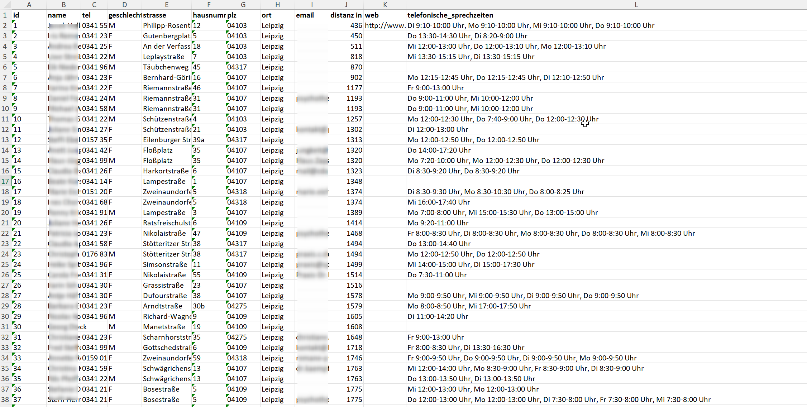
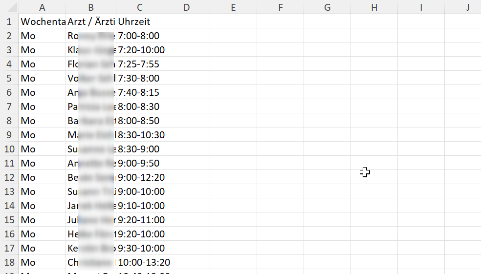

# 116117 Psychotherapie Suche Exporter

Ein einfacher 116117 Psychotherapie Suche Exporter zur Unterstützung bei der Suche nach Psychotherapieplätzen in Deutschland.

## Hintergrund

Ich habe diese App entwickelt, weil es extrem schwierig ist, freie gesetzliche Therapieplätze zu finden. Oft muss man zahlreiche Praxen kontaktieren, nur um immer wieder zu hören, dass keine Kapazitäten frei sind. Dieses Problem ist systemisch – und wer nachweislich keinen Platz findet, hat unter Umständen Anspruch auf Kostenerstattung durch die Krankenkasse wegen Systemversagen. Diese App soll helfen, schneller und einfacher dokumentiert nach verfügbaren Angeboten zu suchen. Zudem kann ein Export der Arztsuche als Datei sehbehinderten Personen helfen, wie in diesem [FragDenStaat-Post](https://fragdenstaat.de/a/299392) angefragt.

## Funktionen

- Suche nach Therapeut:innen in deiner Nähe anhand deiner Postleitzahl  
- Filter nach Verfahrensart, Setting, Einzel/Gruppentherapie
- Exportiere Ergebnisse inkl. Adresse, Fachrichtung und Telefonnummer  
- Telefonzeiten werden strukturiert abgespeichert in separatem Tab

## Beispiel Exporte

Die folgenden Dateien zeigen, welche Daten über die App exportiert werden können:

-   
  Beispiel für die exportierten Praxisdaten (Adresse, Fachrichtung, Telefonnummer).

-   
  Beispiel für die exportierten Telefonsprechzeiten.

-   
  Beispiel einer Excel-Datei, in der die Suchergebnisse exportiert werden können.

## Nutzung der 116117 API

Die Daten für die Arztsuche werden über die API von [116117.de](https://arztsuche.116117.de/) abgerufen. Es ist wichtig, mit der Nutzung dieser API vorsichtig umzugehen, um Missbrauch und übermäßige Anfragen zu vermeiden. Das API-Angebot ist nicht für den intensiven, automatisierten Abruf von großen Datenmengen gedacht. Bitte stelle sicher, dass deine Nutzung der API den rechtlichen Bestimmungen entspricht und keine negativen Auswirkungen auf die Verfügbarkeit der API für andere Nutzer:innen hat.

**Hinweis:** Derzeit ist das Copy-Paste der API-Infos etwas sperrig. Es könnte verbessert werden, um die Nutzung der Daten leichter und benutzerfreundlicher zu gestalten. Falls jemand hier eine Verbesserung beitragen kann, ist dies sehr willkommen!

## Verwendung

1. PLZ eingeben  
2. Optional: Kasse auswählen  
3. Ergebnisse ansehen oder herunterladen  

## Lizenz

Dieses Projekt steht unter der **MIT-Lizenz**.

Diese App verwendet Daten aus dem Repository [WZBSocialScienceCenter/plz_geocoord], das unter der **Apache License 2.0** lizenziert ist. Weitere Informationen unter: http://www.apache.org/licenses/

